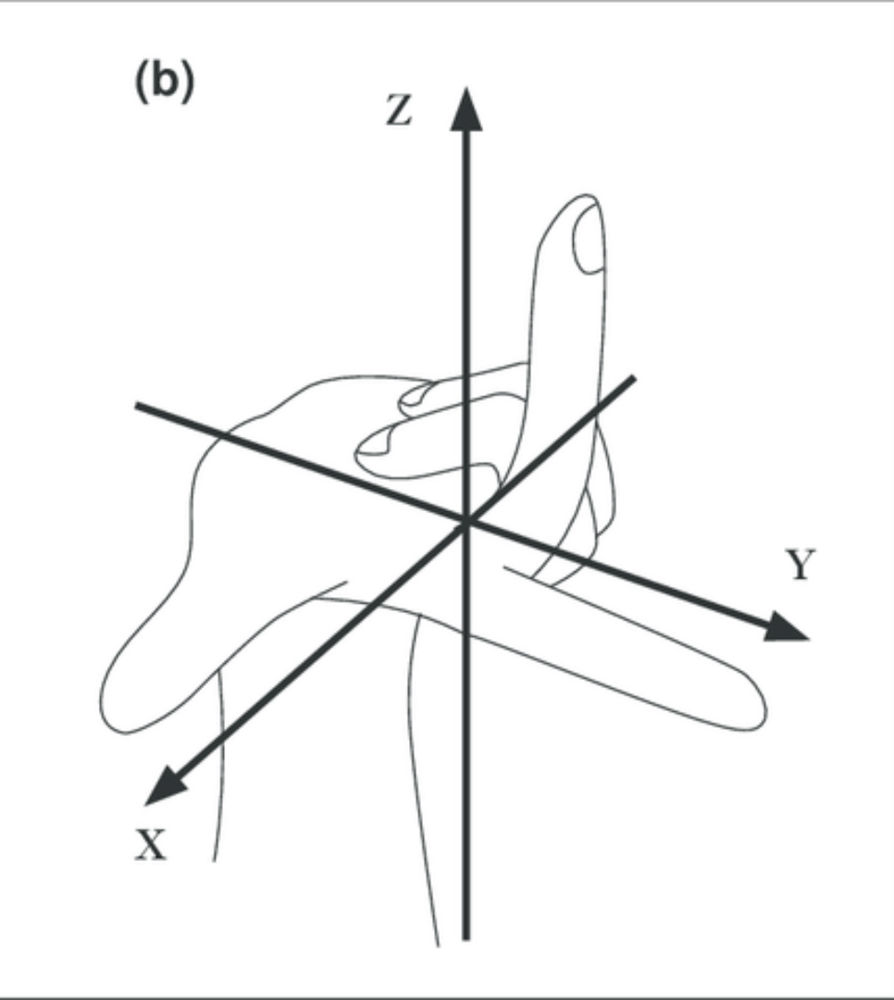

# How to: Extrinsic Calibration

As robots frequently tumble and fall down, we need to adjust not correctly aligned parts of the robots. Additionally, we need the IPM (Inverse Perspective Mapping) to map correctly camera pixels to field coordinates.

In order to adjust the calibration of the visualization you can change the roll (`offset_x`), pitch (`offset_y`) and yaw (`offset_z`) of the camera and the IMU.
The camera parameters change the camera direction and the IMU parameters change the orientation of the body.

1. Start teamplayer in one terminal.

    `ros2 launch bitbots_bringup teamplayer.launch game_controller:=false behavior:=false`

2. Start robot remote control in a second terminal.
    
    `ros2 run bitbots_teleop teleop_keyboard.py`

3. Press key **1** for the look around head mode.

4. Start rviz2 in a third terminal.

    `rviz2`

5. Open config file in **bitbots_misc &rarr; bitbots_extrinsic_calibration &rarr; config**

6. Open rqt and navigate to **Plugins &rarr; Configurations &rarr; Dynamic Reconfigure** where you can configure the parameters.

.. note::
  If you change the calibration first change all parameters to `0.0`.
  Then start with the adjustment of the IMU parameters.

  This is an interactive process and we might need to do a few alternating steps of imu and camera calibration to get a good solution

## IMU Parameters

* change if the lines are unequally distanced to the right/left (`offset_x`) or to the front / sides (`offset_y`)
* has a [right-handed coordinate system](https://www.ros.org/reps/rep-0103.html#coordinate-frame-conventions)

## Camera Parameters

* change if the lines are not aligned equally on both sides / front (`offset_y`) due to the rotation of the head which leads to an error in the cameras frame of reference being present in all directions
* has a [camera coordinate system](https://www.ros.org/reps/rep-0103.html#suffix-frames)

